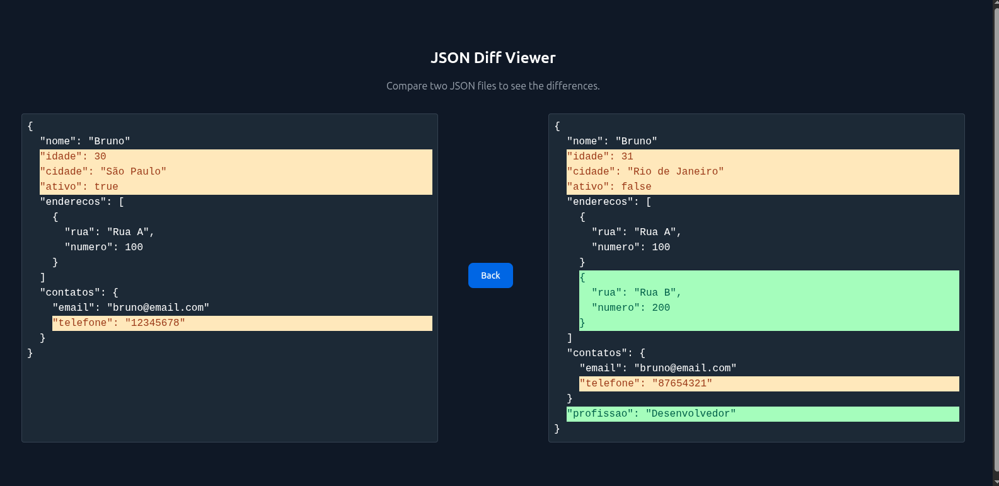

# 🔍 JSON Diff Viewer with Angular

Welcome to **JSON Diff Viewer** – an Angular-powered tool to quickly compare two JSON objects and highlight their differences! 🚀 

[](https://skillicons.dev)

## ✨ Features
- 📝 **Compare Two JSONs** – Find added, removed, or changed keys instantly.  
- 🌈 **Color Highlighting** – Visual differences with clear color coding.  
- 🔄 **Recursive Comparison** – Works with nested objects and arrays.  
- ⚡ **Fast and Lightweight** – Built with Angular, no backend required.  
- 🌐 **Ready for GitHub Pages** – Deploy as a static site with ease.

## 🚀 Live Demo

[**View it here!**](https://mufasa-dev.github.io/Json-diff/)  


## 🖼️ Preview



## 📦 Installation

Clone the repository and install dependencies:

```bash
git clone https://github.com/mufasa-dev/Json-diff.git
cd json-diff-app
npm install
````

## 🛠️ Development

Run the app locally:

```bash
ng serve
```

Open your browser and go to:
👉 **[http://localhost:4200/](http://localhost:4200/)**


## 👨‍💻 Author

Developed with ❤️ by **[Bruno](https://github.com/mufasa-dev)**


## 📜 License

This project is licensed under the **MIT License**.
Feel free to use, modify, and share! 🎉
